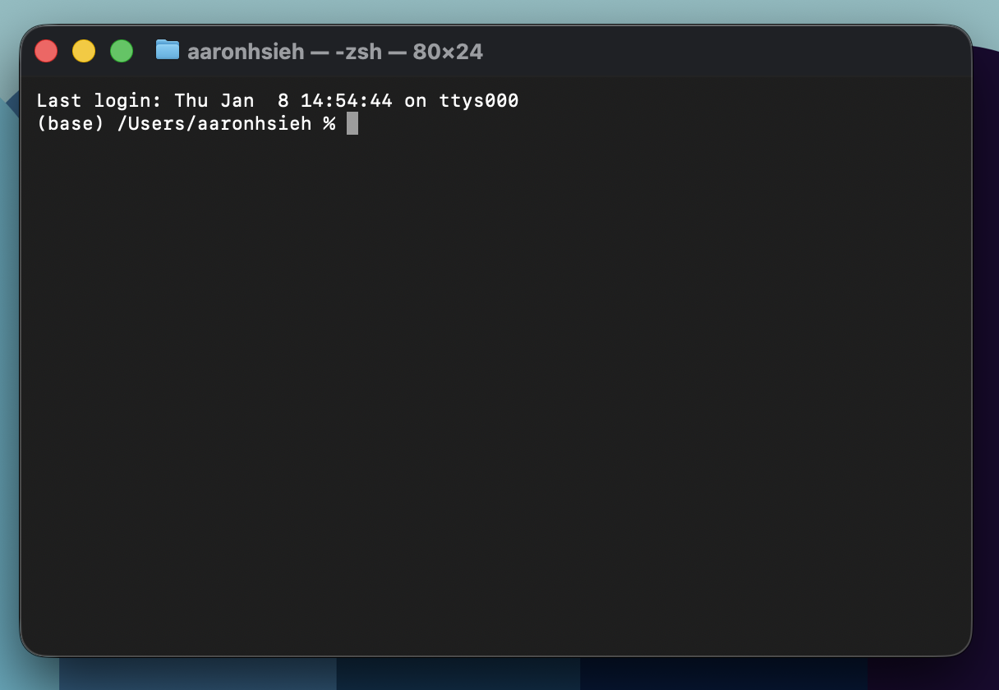

# Introduction and Version Control With Git

## Welcome!
Welcome to [class name]!

## The Terminal

Before we even start with coding, we must first learn about the terminal and version control.

The terminal (also called command line or command prompt on Windows) is a text-based interface that allows you to interact with your computer through typed commands instead of clicking with a mouse.

<div align="center">
  
  <p><em>The Terminal</em></p>
</div>

Think of it like texting with your computer—you type commands, hit enter, and your computer responds.

**Why use the terminal?** While graphical user interfaces (GUIs) that allow point/click are easier to learn, the terminal is powerful for programmers because:

- **Speed**: Typing commands is often faster than navigating menus
- **Automation**: You can write code to automate repetitive tasks
- **Remote work**: You can control computers over the internet (common in machine learning research)
- **Developer tools**: Many programming tools only work through the terminal

**Opening the terminal:**
- **Mac**: Press <kbd>⌘</kbd> + <kbd>Space</kbd>, type `terminal`, and press <kbd>Enter</kbd>
- **Windows**: Press <kbd>Win</kbd>, type `cmd` or `powershell`, and press <kbd>Enter</kbd>

**Understanding the prompt:**

When you open the terminal, you'll see a **prompt** that looks something like this:

```
username@computer:~$
```

This shows you're ready to type a command. Let's break down what each part means:

- **`username`** - Your computer login name (e.g., `aaronhsieh`)
- **`@`** - Simply means "at"
- **`computer`** - Your computer's name (e.g., `Aarons-MacBook`)
- **`:`** - Separator between computer name and current location
- **`~`** - Your **current directory** (the tilde `~` represents your home directory/user folder)
- **`$`** - The prompt symbol indicating you can type a command (on some systems this might be `%` or `#`)

So `username@computer:~$` reads as: "user **username** at **computer**, currently in the **home directory**, ready for a command."

**What does "current directory" mean?**

Think of your terminal as being "inside" a folder at all times, just like when you have a Finder window (Mac) or File Explorer window (Windows) open to a specific folder. Your **current directory** is simply which folder the terminal is currently "inside of."

When you run commands, they operate on files in your current directory unless you specify otherwise. It's like saying "I'm currently in my Documents folder, so if I ask to see files, show me what's in Documents."

## Essential Commands: Finding Your Sciatic Nerve Photo Collection

You just downloaded a new photo of the sciatic nerve. It's a good one— you've never seen anything like it. The problem? You forgot where you put your sciatic nerve photo collection folder. You need to navigate your computer, find (or create) the folder, and organize your collection.

### Step 1: Where am I? (`pwd`)

First, you need to figure out where you currently are in your computer.

```bash
pwd
```

**Output**: `/Users/yourname`

The `pwd` command stands for "Print Working Directory"—it tells you your current location. You're in your home directory. The sciatic nerve is not here yet.

### Step 2: What's here? (`ls`)

Let's see what folders are around you.

```bash
ls
```

**Output**: `Desktop  Documents  Downloads  Music  Pictures`

The `ls` command lists all files and folders in your current directory. You scan the list. No sciatic nerve folder. Concerning.

**Pro tip**: Want more details about your files?

```bash
ls -la
```

This shows file sizes, permissions, and even hidden files (files that start with a dot). Maybe the sciatic nerve is hiding.

### Step 3: Navigate somewhere (`cd`)

Your sciatic nerve collection is probably in Pictures. Let's go there.

```bash
cd Pictures
```

The `cd` command stands for "Change Directory"—it moves you to a different folder. You are now in Pictures.

**Other useful `cd` tricks**:
- `cd ..` - Go up one level (back to where you came from)
- `cd ~` - Go to your home directory (instant teleportation)
- `cd my_folder/subfolder` - Navigate multiple folders deep in one command

### Step 4: The folder doesn't exist (`mkdir`)

You look around. There's no sciatic nerve folder. This is a crisis. Make one immediately.

```bash
mkdir sciatic_nerve_archive
```

The `mkdir` command stands for "Make Directory"—it creates a new folder. You now have a dedicated sanctuary for sciatic nerve photos.

### Step 5: Enter the archive

```bash
cd sciatic_nerve_archive
```

Now you're inside. Confirm your location:

```bash
pwd
```

**Output**: `/Users/yourname/Pictures/sciatic_nerve_archive`

You have arrived.

### Step 6: Create placeholder files (`touch`)

You need to organize your photos by category. Create some empty files to represent different types of sciatic nerve photos you'll collect.

```bash
touch cross_section.jpg
touch longitudinal_view.jpg
touch with_lumbar_plexus.jpg
touch nerve_compression.jpg
```

The `touch` command creates new empty files. These files don't have actual images yet—they're just placeholders. Digital promises of future sciatic nerve content.

Check that they exist:

```bash
ls
```

**Output**: `cross_section.jpg  longitudinal_view.jpg  nerve_compression.jpg  with_lumbar_plexus.jpg`

Beautiful.

### Step 7: You made a mistake (`rm`)

Wait. You accidentally created a file for "sciatic_nerve_smiling.jpg" which makes no sense. Nerves don't smile. They don't have faces. This file is anatomically impossible.

First, create the mistake:

```bash
touch sciatic_nerve_smiling.jpg
```

Verify the error:

```bash
ls
```

**Output**: `cross_section.jpg  longitudinal_view.jpg  nerve_compression.jpg  sciatic_nerve_smiling.jpg  with_lumbar_plexus.jpg`

Unacceptable. Delete it:

```bash
rm sciatic_nerve_smiling.jpg
```

The `rm` command removes (deletes) files. **WARNING**: This is permanent! There's no undo. If you accidentally delete your entire sciatic nerve collection, it's gone forever. Handle with care.

**To delete a folder** and everything inside:

```bash
rm -r folder_name
```

The `-r` flag means "recursive"—it deletes the folder and all its contents. Don't use this lightly. You could erase years of sciatic nerve curation.

### Step 8: Organize by category (`mkdir`)

Let's create subfolders for different types of sciatic nerve images.

```bash
mkdir anatomy_diagrams
mkdir pathology
mkdir surgical_views
mkdir memes
```

Check your organizational structure:

```bash
ls
```

**Output**: `anatomy_diagrams  cross_section.jpg  longitudinal_view.jpg  memes  nerve_compression.jpg  pathology  surgical_views  with_lumbar_plexus.jpg`

Perfect. Your archive is taking shape.

Peek inside one of the folders:

```bash
ls memes
```

**Output**: (nothing—it's empty, waiting for sciatic nerve memes)

### Step 9: Check file contents (`cat`)

Want to see what's in a file? Use `cat`.

```bash
cat cross_section.jpg
```

**Output**: (a bunch of gibberish—you can't actually read image files as text!)

The `cat` command displays the contents of a file in your terminal. It's short for "concatenate" but people mostly use it to quickly read text files. Don't use it on images unless you want your terminal to look like it's having a seizure.

### Step 10: Clear the chaos (`clear`)

Your terminal is now full of random commands and possibly corrupted sciatic nerve image data. Clean it up:

```bash
clear
```

This clears your screen but doesn't delete anything—it just makes everything disappear from view. Your commands are still in history (press up arrow to see them). It's like closing your eyes and pretending nothing happened.

### Step 11: Mission complete (`cd ..`)

You've organized your sciatic nerve archive. Time to leave.

```bash
cd ..
```

Remember, `..` means "one level up." You're back in Pictures. Confirm:

```bash
pwd
```

**Output**: `/Users/yourname/Pictures`

Success. Your sciatic nerve photo collection has a home. The detailed cross-section will go in `anatomy_diagrams`. Everything is as it should be.

## Tips for Beginners

- **Tab completion**: Start typing a filename or folder name and press <kbd>Tab</kbd> to auto-complete
- **Arrow keys**: Press <kbd>↑</kbd> to cycle through previous commands
- **Copy/Paste**: Usually <kbd>Ctrl</kbd> + <kbd>C</kbd> / <kbd>Ctrl</kbd> + <kbd>V</kbd> on Windows, <kbd>⌘</kbd> + <kbd>C</kbd> / <kbd>⌘</kbd> + <kbd>V</kbd> on Mac
- **Stuck?**: Press <kbd>Ctrl</kbd> + <kbd>C</kbd> to cancel the current command

