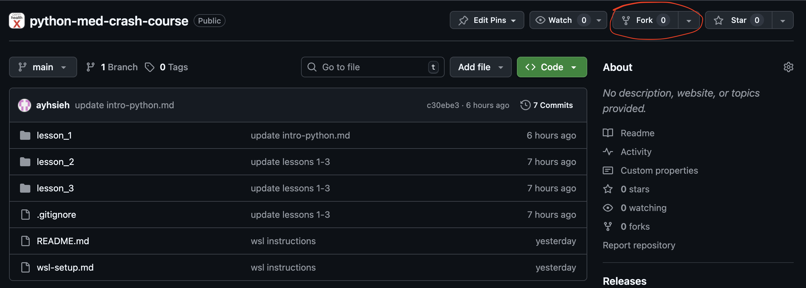
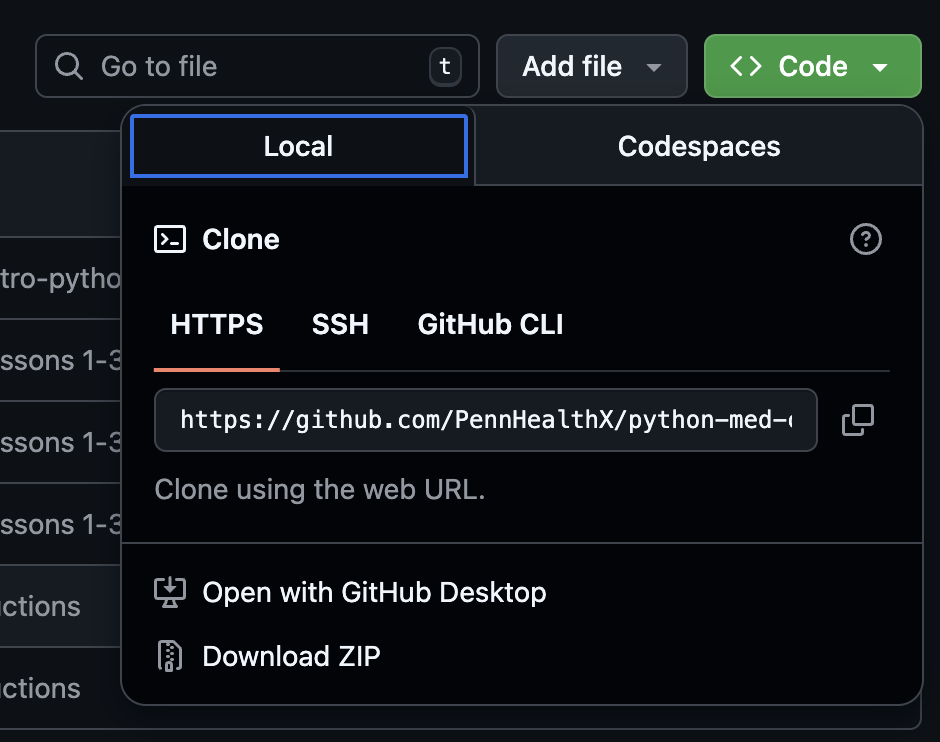

# Introduction and Version Control With Git

## The Terminal

The terminal (also called command line or command prompt on Windows) is a text-based interface that allows you to interact with your computer through typed commands instead of clicking with a mouse.

<div align="center">
  
  <p><em>The Terminal</em></p>
</div>

Think of it like texting with your computer—you type commands, hit enter, and your computer responds.

**Why use the terminal?** While graphical user interfaces (GUIs) that allow point/click are easier to learn, the terminal is powerful for programmers because:

- **Speed**: Typing commands is often faster than navigating menus
- **Automation**: You can write code to automate repetitive tasks
- **Remote work**: You can control computers over the internet (common in machine learning research)
- **Developer tools**: Many programming tools only work through the terminal

**Opening the terminal:**
- **Mac**: Press <kbd>⌘</kbd> + <kbd>Space</kbd>, type `terminal`, and press <kbd>Enter</kbd>
- **Windows**: Press <kbd>Win</kbd>, type `cmd` or `powershell`, and press <kbd>Enter</kbd>

**Understanding the prompt:**

When you open the terminal, you'll see a **prompt** that looks something like this:

```
username@computer:~$
```

This shows you're ready to type a command. Let's break down what each part means:

- **`username`** - Your computer login name (e.g., `aaronhsieh`)
- **`@`** - Simply means "at"
- **`computer`** - Your computer's name (e.g., `Aarons-MacBook`)
- **`:`** - Separator between computer name and current location
- **`~`** - Your **current directory** (the tilde `~` represents your home directory/user folder)
- **`$`** - The prompt symbol indicating you can type a command (on some systems this might be `%` or `#`)

So `username@computer:~$` reads as: "user **username** at **computer**, currently in the **home directory**, ready for a command."

**What does "current directory" mean?**

Think of your terminal as being "inside" a folder at all times, just like when you have a Finder window (Mac) or File Explorer window (Windows) open to a specific folder. Your **current directory** is simply which folder the terminal is currently "inside of."

When you run commands, they operate on files in your current directory unless you specify otherwise. It's like saying "I'm currently in my Documents folder, so if I ask to see files, show me what's in Documents."

---

## Basic Terminal Commands: Your First Practice

Let's learn essential terminal commands by creating a simple project from scratch! We'll create folders, files, and practice navigating - just like a real programming workflow.

### Understanding Command Structure

Before we start, let's understand how terminal commands work. Most commands follow this basic pattern:

```
command -flags arguments
```

Breaking this down:
- **`command`** is the action you want to perform (like `mkdir`, `cd`, `ls`)
- **`-flags`** (optional) are options that modify how the command behaves. Flags start with a dash (`-`) and come after the command name. Think of them as settings you turn on. Some commands use single-letter flags like `-p`, while others use word flags like `--parents`.
- **`arguments`** are what you want the command to act on (like a filename or folder name)

For example, in `mkdir -p code/python`:
- **`mkdir`** is the command (make directory)
- **`-p`** is a flag (create parent directories if needed)
- **`code/python`** is the argument (the folder path to create)

You'll see this pattern throughout all the commands below. Don't worry about memorizing this - it'll make more sense as we practice!

---

### 1. **pwd** - Print Working Directory

First, let's see where we are:

```bash
pwd
```

**Expected output** (yours will be different):
```
/Users/yourname
```

This shows your current location in the file system. You're probably in your home directory (`~`).

### 2. **ls** - List files and directories

See what's in your current folder:

```bash
ls
```

**Expected output** (yours will vary):
```
Desktop    Documents    Downloads    Pictures    Music
```

### 3. **mkdir** - Create a directory

Let's create a folder for our first coding project:

```bash
mkdir my-first-project
```

Verify it was created:

```bash
ls
```

You should now see `my-first-project` in the list!

### 4. **cd** - Change directory

Navigate into your new folder:

```bash
cd my-first-project
```

Check where you are now:

```bash
pwd
```

**Expected output:**
```
/Users/yourname/my-first-project
```

### 5. **touch** - Create an empty file

Create a file for project notes:

```bash
touch notes.txt
```

Verify it exists:

```bash
ls
```

**Expected output:**
```
notes.txt
```

### 6. **echo and >** - Write to a file

Add some text to your file:

```bash
echo 'This is my first project!' > notes.txt
```

The `>` symbol redirects the output into the file. Note: We use single quotes (`'`) here instead of double quotes to avoid issues with special characters.

### 7. **cat** - Display file contents

Read what's in the file:

```bash
cat notes.txt
```

**Expected output:**
```
This is my first project!
```

### 8. **mkdir with subdirectories**

Create a folder structure for code:

```bash
mkdir -p code/python
```

The `-p` flag creates parent directories if they don't exist. Without it, `mkdir code/python` would fail if `code` doesn't already exist.

Check your structure:

```bash
ls
```

**Expected output:**
```
code    notes.txt
```

See what's inside the code folder:

```bash
ls code
```

**Expected output:**
```
python
```

### 9. **cd with paths**

Navigate to the nested folder:

```bash
cd code/python
```

Check where you are:

```bash
pwd
```

**Expected output:**
```
/Users/yourname/my-first-project/code/python
```

Go back up one level:

```bash
cd ..
```

Now you're in the `code` folder. Go back to your project root:

```bash
cd ..
```

Now you're back in `my-first-project`.

### 10. **cp** - Copy files

Let's create a backup of our notes:

```bash
cp notes.txt notes-backup.txt
```

Verify both files exist:

```bash
ls
```

**Expected output:**
```
code    notes-backup.txt    notes.txt
```

### 11. **mv** - Move or rename files

Rename the backup:

```bash
mv notes-backup.txt backup.txt
```

Check the result:

```bash
ls
```

**Expected output:**
```
backup.txt    code    notes.txt
```

Move the backup into the code folder:

```bash
mv backup.txt code/
```

Verify it moved:

```bash
ls code
```

**Expected output:**
```
backup.txt    python
```

### 12. **head** and **tail** - View parts of files

Let's add more content to our notes:

```bash
echo 'Line 2: Learning terminal commands' >> notes.txt
echo 'Line 3: This is fun' >> notes.txt
```

Note: `>>` appends to the file instead of overwriting.

View the first line:

```bash
head -n 1 notes.txt
```

**Expected output:**
```
This is my first project!
```

View the last line:

```bash
tail -n 1 notes.txt
```

**Expected output:**
```
Line 3: This is fun
```

### 13. **rm** - Remove files and directories

⚠️ **Warning**: This permanently deletes files! There is no undo!

`rm` is powerful and dangerous. Always double-check what you're about to delete. Common mistakes include:
- Being in the wrong directory
- Typos in file paths (e.g., an accidental space can delete the wrong thing)
- Using wildcards like `*` without verifying first

**Safety tip**: Before deleting anything, verify what you're about to remove:

```bash
# First, check where you are
pwd
```

**Expected output:**
```
/Users/your-username/my-first-project
```

```bash
# List what's in the folder you're about to delete from
ls code
```

**Expected output:**
```
backup.txt  python
```

Now delete the backup file:

```bash
rm code/backup.txt
```

Verify it's gone:

```bash
ls code
```

**Expected output:**
```
python
```

To delete a directory (folder) and everything inside, use `rm -r` (recursive).

```bash
rm -r code
```

The `-r` flag means "recursive" (delete the folder and all contents).

Verify that the `code` folder is gone:

```bash
ls
```

**Expected output:**
```
notes.txt
```

> **Pro tip**: If you are worried about deleting the wrong files, consider using `rm -i` or `rm -ri` by default. The few extra seconds of confirmation can save you from catastrophic mistakes.

### 14. **vi** (or **vim**) - Text editor (optional - skip if short on time)

Edit your notes file directly in the terminal:

```bash
vi notes.txt
```

This opens the vi text editor:

1. Press <kbd>i</kbd> to enter Insert mode
2. Add a new line: "Edited with vi!"
3. Press <kbd>Esc</kbd> to exit Insert mode
4. Type `:wq` and press <kbd>Enter</kbd> to save and quit

Verify your changes:

```bash
cat notes.txt
```

### Quick Practice Challenge

Before moving on, try this on your own:
1. Create a folder called `test-folder`
2. Create a file inside it called `hello.txt`
3. Write "Hello, World" into the file using `echo`
4. Display the file contents
5. Delete the entire `test-folder`

**Solution:**
```bash
mkdir test-folder
touch test-folder/hello.txt
echo 'Hello, World' > test-folder/hello.txt
cat test-folder/hello.txt
rm -r test-folder
```

### Clean Up

When you're done practicing, you can delete your project folder. First, go back to your home directory:

```bash
cd ~
```

Then remove the project:

```bash
rm -r my-first-project
```

---

## Introduction to Git and Version Control

Now that you know basic terminal commands, let's learn about **Git** - a version control system that programmers use to track changes in their code and collaborate with others.

**What is Git?**
- Tracks every change you make to your files
- Lets you go back to previous versions if something breaks
- Enables multiple people to work on the same project
- The industry standard for code collaboration

**What is GitHub?**
- A website where you store your Git repositories online
- Like Google Drive, but specifically designed for code
- Allows you to share code and collaborate with others

Let's set up your own copy of this course repository so you can practice Git commands!

### Step 1: Fork the Repository on GitHub

First, create your own copy of the repository on GitHub (called a "fork"):

1. Go to the course repository on GitHub: `https://github.com/PennHealthX/python-med-crash-course`
2. Click the **Fork** button in the top-right corner

<div align="center">
  
  <p><em>GitHub Fork (Top Right)</em></p>
</div>

3. GitHub will create a copy under your account: `https://github.com/YOUR-USERNAME/python-med-crash-course`

**Why fork?** This gives you your own copy where you can practice making changes and pushing code without affecting the original course repository!

### Step 2: Clone Your Fork

Now download your forked repository to your computer:

```bash
git clone https://github.com/YOUR-USERNAME/python-med-crash-course.git
```

Replace `YOUR-USERNAME` with your actual GitHub username!

Alternatively, you can click on the green code in the top right and copy the url:

<div align="center">
  
</div>

> Make sure you select HTTPS as opposed to SSH!

**Expected output:**
```
Cloning into 'python-med-crash-course'...
remote: Enumerating objects: 50, done.
remote: Counting objects: 100% (50/50), done.
remote: Compressing objects: 100% (35/35), done.
Receiving objects: 100% (50/50), done.
```

This creates a folder called `python-med-crash-course` in your current directory.

### Step 3: Navigate to the Repository

```bash
cd python-med-crash-course
```

You're now inside your local copy of the repository!

### Pulling Updates from the Original Repository

As the instructor adds new materials, you'll want to sync them to your fork. First, set up the original repository as an "upstream" remote (you only need to do this once):

```bash
git remote add upstream https://github.com/PennHealthX/python-med-crash-course.git
```

Replace `INSTRUCTOR-USERNAME` with the instructor's GitHub username.

**To get the latest updates:**

```bash
git pull upstream main
```

**Expected output:**
```
remote: Enumerating objects: 15, done.
remote: Counting objects: 100% (15/15), done.
Updating abc1234..def5678
Fast-forward
 lesson_3/intro-and-git.md           | 200 ++++++++++++++++++++
 lesson_3/terminal-tutorial/...      |  25 +++
 2 files changed, 225 insertions(+)
```

**Push updates to your fork:**

```bash
git push origin main
```

This updates your fork on GitHub with the new materials.

### Essential Git Commands

| Command | What it does |
|---------|--------------|
| `git clone <url>` | Download a repository for the first time |
| `git pull upstream main` | Get latest updates from the original course repository |
| `git push origin main` | Upload your changes to your fork on GitHub |
| `git status` | See what files you've changed locally |
| `git add <file>` | Stage a file to be committed |
| `git commit -m "message"` | Save your changes with a description |
| `git log` | View the history of changes |

**Tip**: Before starting each lesson, run `git pull upstream main` to get the latest materials, then `git push origin main` to sync your fork!

---

## Putting It All Together: Advanced Terminal Practice

Now you know both terminal commands AND Git! Let's use what you've learned to navigate to the course repository and practice with a more complex folder structure.

### Navigate to the Tutorial Folder

Remember the terminal commands you just learned? Let's use them:

1. **Check where you are:**
   ```bash
   pwd
   ```

2. **If you're not in the repository, navigate to it:**
   ```bash
   cd python-med-crash-course
   ```

   Or use the full path if needed:
   ```bash
   cd ~/python-med-crash-course
   ```

3. **Verify you're in the right place:**
   ```bash
   ls
   ```

   **Expected output:**
   ```
   README.md    lesson_1    lesson_2    lesson_3
   ```

4. **Navigate to the terminal tutorial folder:**
   ```bash
   cd lesson_3/terminal-tutorial
   ```

5. **Confirm you've arrived:**
   ```bash
   pwd
   ```

   **Expected output** (path will vary):
   ```
   /Users/yourname/python-med-crash-course/lesson_3/terminal-tutorial
   ```

Great! Now you're in the tutorial folder. Let's explore the practice files we've prepared for you.

---

### Exploring the Tutorial Files

Now let's practice with the pre-made folder structure. You already know these commands from earlier - this is your chance to reinforce what you learned!

**Welcome to the Clinical Research Lab!** The `terminal-tutorial` folder simulates a real medical data science research environment. You'll find patient data, research protocols, lab meeting notes, and analysis scripts - exactly the kind of files you'd work with in clinical research.

#### **ls** - Review the folder structure

Let's see what's in our current folder:

```bash
ls
```

**Expected output:**
```
documents    projects    welcome.txt
```

Now try listing with more details:
```bash
ls -la
```

**Expected output** (yours may vary slightly):
```
total 8
drwxr-xr-x  5 user  staff  160 Jan 13 10:30 .
drwxr-xr-x  8 user  staff  256 Jan 13 10:29 ..
drwxr-xr-x  4 user  staff  128 Jan 13 10:30 documents
drwxr-xr-x  4 user  staff  128 Jan 13 10:30 projects
-rw-r--r--  1 user  staff   32 Jan 13 10:30 welcome.txt
```

The `-la` flags show hidden files, permissions, file sizes, and modification dates.

#### **cd** - Navigate through folders

Navigate into the `documents` folder:

```bash
cd documents
```

Your prompt should now show you're in the `documents` directory. Check where you are:

```bash
ls
```

**Expected output:**
```
notes    practice.txt    reports
```

Go back up one level to the parent directory:

```bash
cd ..
```

You're now back in `terminal-tutorial`. Try going directly to a nested folder:

```bash
cd documents/notes
```

**Expected output** (using `ls`):
```
ideas.txt    meeting.txt
```

Return to your home directory anytime with:
```bash
cd ~
```

Then navigate back to the tutorial folder to continue.

#### **cat** - Read file contents

Let's read the welcome message:

```bash
cat welcome.txt
```

**Expected output:**
```
Welcome to the Medical Data Science Terminal Tutorial!

You're now working in a simulated clinical research environment.
This folder contains patient data, research notes, and analysis scripts.
Practice your terminal skills while exploring healthcare data!
```

Try reading a research protocol file:

```bash
cat documents/practice.txt
```

**Expected output:**
```
Clinical Research Protocol - HF-2024-001

Study Title: Heart Failure Readmission Risk Prediction
Principal Investigator: Dr. Sarah Chen
Study Period: January 2024 - December 2024

Objective: Develop a machine learning model to predict 30-day readmission risk
for patients with heart failure using electronic health record (EHR) data.

Primary Endpoint: 30-day all-cause hospital readmission
Sample Size: 500 patients
```

#### **head** and **tail** - View parts of files

For longer files, `head` shows the first few lines and `tail` shows the last few:

```bash
head welcome.txt
```

**Expected output:**
```
Welcome to the Medical Data Science Terminal Tutorial!

You're now working in a simulated clinical research environment.
This folder contains patient data, research notes, and analysis scripts.
Practice your terminal skills while exploring healthcare data!
```

Let's look at the end of the lab meeting notes:

```bash
tail documents/notes/meeting.txt
```

**Expected output:**
```
Action Items:
- Alex: Run preliminary logistic regression baseline model
- Maria: Contact EMR team about missing lab values
- Dr. Chen: Review updated consent forms for IRB
```

With the `-n` flag, you can specify how many lines:
```bash
head -n 1 welcome.txt
```

#### **mkdir** - Create your own folders

In research, you often need to organize data into folders. Let's create a backup folder for important files:

```bash
mkdir backup
```

Verify it was created:
```bash
ls
```

**Expected output:**
```
backup    documents    projects    welcome.txt
```

Create nested folders all at once with `-p` (useful for organizing analysis results):

```bash
mkdir -p backup/important/archive
```

This creates `backup/important/archive` even if the parent folders don't exist yet - perfect for organizing datasets by date or experiment.

#### **touch** - Create empty files

Let's create a file to track your analysis notes:

```bash
touch backup/analysis_notes.txt
```

Check that it exists:
```bash
ls backup
```

**Expected output:**
```
analysis_notes.txt    important
```

#### **cp** - Copy files and folders

In research, you often need to back up important files before making changes. Let's copy the protocol document:

```bash
cp documents/practice.txt backup/protocol_backup.txt
```

Verify the copy:
```bash
ls backup
```

**Expected output:**
```
analysis_notes.txt    important    protocol_backup.txt
```

Copy an entire folder using `-r` (recursive) - useful for backing up entire datasets:

```bash
cp -r documents backup/documents_backup
```

#### **mv** - Move and rename files

Rename your analysis notes to be more specific:

```bash
mv backup/analysis_notes.txt backup/hf_analysis_notes.txt
```

Move the welcome file to your backup folder:

```bash
mv welcome.txt backup/
```

Check the results:
```bash
ls backup
```

**Expected output:**
```
documents_backup    hf_analysis_notes.txt    important    protocol_backup.txt    welcome.txt
```

Notice `welcome.txt` is now in the backup folder, not the main folder - helpful for organizing completed work!

#### **rm** - Delete files and directories

⚠️ **Warning**: This permanently deletes files - there's no undo! Be extra careful with patient data!

Delete a duplicate backup file:

```bash
rm backup/protocol_backup.txt
```

Delete an empty directory:
```bash
rm -r backup/important
```

To be safe, use `-i` for confirmation (highly recommended when working with research data):

```bash
rm -i backup/hf_analysis_notes.txt
```

This will ask you to confirm before deleting - a good habit for protecting valuable research files.

#### **vi** (or **vim**) - Text editor (optional - skip if short on time)

`vi` (or its improved version `vim`) is a powerful text editor built into most Unix-based systems. It's essential to know the basics because you'll often need to edit files directly in the terminal when no graphical interface is provided. 

**The tricky part**: `vi` has different "modes" - you can't just start typing like in a normal text editor!

Let's practice by creating analysis notes for the patient data:

```bash
vi projects/analysis_log.txt
```

This opens `vi` with a new file called `analysis_log.txt` where you might track your data analysis steps.

**Important vi modes:**
- **Normal mode** (default): Navigate and run commands
- **Insert mode**: Actually type and edit text
- **Command mode**: Save, quit, and other commands

**Basic vi workflow:**

1. **Enter Insert mode** - Press <kbd>i</kbd>
   - You should see `-- INSERT --` at the bottom
   - Now you can type normally

2. **Type some text**:
   ```
   Analysis Log - Heart Failure Study
   Date: 2024-01-15
   Dataset: 347 patients with heart failure
   Next steps: Clean missing lab values, run baseline model
   ```

3. **Exit Insert mode** - Press <kbd>Esc</kbd>
   - You're back in Normal mode

4. **Save and quit** - Type `:wq` then press <kbd>Enter</kbd>
   - `:w` = write (save)
   - `:q` = quit
   - Combined: `:wq` saves and quits

**Verify it worked:**
```bash
cat projects/analysis_log.txt
```

**Expected output:**
```
Analysis Log - Heart Failure Study
Date: 2024-01-15
Dataset: 347 patients with heart failure
Next steps: Clean missing lab values, run baseline model
```

**Essential vi commands to remember:**

| Command | What it does |
|---------|--------------|
| `i` | Enter Insert mode (start typing) |
| <kbd>Esc</kbd> | Exit Insert mode (back to Normal mode) |
| `:w` | Save (write) the file |
| `:q` | Quit vi |
| `:wq` | Save and quit |
| `:q!` | Quit without saving (force quit) |
| `dd` | Delete current line (in Normal mode) |
| `u` | Undo (in Normal mode) |
| `/search` | Search for "search" in the file |

**Common beginner mistake**: Trying to type without pressing `i` first, or forgetting to press <kbd>Esc</kbd> before using commands!

**If you get stuck in vi**: Press <kbd>Esc</kbd> multiple times, then type `:q!` and press <kbd>Enter</kbd> to quit without saving.

**Practice editing the research protocol:**
```bash
vi documents/practice.txt
```

Try these steps:
1. Press <kbd>i</kbd> to enter Insert mode
2. Add a new line at the bottom: "Status: Data collection in progress - 347/500 patients enrolled"
3. Press <kbd>Esc</kbd>
4. Type `:wq` and press <kbd>Enter</kbd>
5. Verify with: `cat documents/practice.txt`

---

**Practice Challenge**: Try these tasks on your own:
1. Create a new folder called `test`
2. Create a file inside it called `experiment.txt`
3. Copy `documents/practice.txt` into the `test` folder
4. List the contents of `test`
5. Delete the entire `test` folder

**Solution**:
```bash
mkdir test
touch test/experiment.txt
cp documents/practice.txt test/
ls test
rm -r test
```

---

## Practice: Commit and Push Your Changes

You've been practicing in the `terminal-tutorial` folder and created files like `backup/`, `test/`, etc. Let's use Git to save these changes to your fork!

### Step 1: Check What Changed

First, let's see what files you modified:

```bash
git status
```

**Expected output:**
```
On branch main
Your branch is up to date with 'origin/main'.

Changes not staged for commit:
  (use "git add <file>..." to update what will be committed)
  (use "git restore <file>..." to discard changes in working directory)

	modified:   lesson_3/terminal-tutorial/documents/practice.txt

Untracked files:
  (use "git add <file>..." to include in what will be committed)
	lesson_3/terminal-tutorial/backup/

no changes added to commit (use "git add" and/or "git commit -a")
```

This shows:
- **Modified files** (red): Files you changed
- **Untracked files** (red): New files/folders Git doesn't know about yet

### Step 2: Stage Your Changes

Add the files you want to save. You can add specific files or all changes:

**Option 1: Add specific files**
```bash
git add lesson_3/terminal-tutorial/backup/
git add lesson_3/terminal-tutorial/documents/practice.txt
```

**Option 2: Add all changes (easier)**
```bash
git add .
```

The `.` means "add everything in the current directory and subdirectories."

Check status again:

```bash
git status
```

**Expected output:**
```
On branch main
Your branch is up to date with 'origin/main'.

Changes to be committed:
  (use "git restore --staged <file>..." to unstage)
	modified:   lesson_3/terminal-tutorial/documents/practice.txt
	new file:   lesson_3/terminal-tutorial/backup/notes.txt
	new file:   lesson_3/terminal-tutorial/backup/welcome_copy.txt
```

Files are now **staged** (green) - ready to commit!

### Step 3: Commit Your Changes

Create a snapshot of your changes with a descriptive message:

```bash
git commit -m "Complete terminal tutorial practice exercises"
```

**Expected output:**
```
[main abc1234] Complete terminal tutorial practice exercises
 3 files changed, 15 insertions(+)
 create mode 100644 lesson_3/terminal-tutorial/backup/notes.txt
 create mode 100644 lesson_3/terminal-tutorial/backup/welcome_copy.txt
```

**Tips for commit messages:**
- Use present tense: "Add feature" not "Added feature"
- Be descriptive but concise
- Explain what you did, not how you did it

### Step 4: Push to Your Fork

Upload your commit to GitHub:

```bash
git push origin main
```

**Expected output:**
```
Enumerating objects: 8, done.
Counting objects: 100% (8/8), done.
Delta compression using up to 8 threads
Compressing objects: 100% (5/5), done.
Writing objects: 100% (5/5), 532 bytes | 532.00 KiB/s, done.
Total 5 (delta 2), reused 0 (delta 0)
To https://github.com/YOUR-USERNAME/python-med-crash-course.git
   abc1234..def5678  main -> main
```

### Step 5: Verify on GitHub

1. Go to your fork on GitHub: `https://github.com/YOUR-USERNAME/python-med-crash-course`
2. You should see your commit message at the top
3. Click on the commit message to see what files changed
4. Navigate to `lesson_3/terminal-tutorial/` to see your practice files!

---

### The Git Workflow (Summary)

Remember this sequence - you'll use it constantly:

```bash
# 1. Check what changed
git status

# 2. Stage your changes
git add .

# 3. Commit with a message
git commit -m "Your descriptive message here"

# 4. Push to GitHub
git push origin main
```

**Pro tip:** Before starting work each day, pull the latest changes:
```bash
git pull upstream main  # Get updates from course repo
git push origin main    # Sync your fork
```

---

## Summary: What You've Learned

Congratulations! You've learned the essential tools every programmer uses daily. Here's what you can now do:

### Terminal Commands
- **Navigate**: `pwd`, `cd`, `ls` - Move around your file system
- **Create**: `mkdir`, `touch` - Make folders and files
- **Read**: `cat`, `head`, `tail` - View file contents
- **Modify**: `cp`, `mv` - Copy and move files
- **Delete**: `rm` - Remove files and folders (carefully!)
- **Edit**: `vi`/`vim` - Edit files directly in terminal (advanced)

### Git Commands
- **Clone**: Download repositories with `git clone`
- **Update**: Get latest changes with `git pull`
- **Track**: Use `git status` to see what changed
- **Save**: `git add` and `git commit` to save your work
- **Share**: `git push` to upload your changes

### The Workflow
1. Use **terminal commands** to navigate and organize your code
2. Use **Git** to track changes and collaborate with others
3. Combine both to work efficiently on programming projects

### What We Covered (And What's Still Out There)

This lesson introduced the fundamental commands you'll use daily. But here's the thing: both the terminal and Git are incredibly deep tools with way more functionality than what we've covered. There are advanced flags, shortcuts, powerful combinations, and entire workflows we haven't touched.

**That's completely fine.** You've learned the core 20% that handles 80% of everyday tasks. The rest? You'll pick it up as you need it.

### A Reality Check About Learning Commands

You're probably not going to remember all these commands immediately. That's normal.

Professional developers constantly Google "how to undo git commit" or "how to delete a folder in terminal" - even after years of experience. It's not a sign you're not getting it. Some commands you'll use so often they become muscle memory. Others you'll look up every single time you need them, and that's just part of the job.

What matters isn't memorizing every flag and option. What matters is:
- Knowing these tools exist
- Understanding what they're used for
- Being able to look up syntax when you need it
- Building confidence through practice

The commands will stick naturally through repetition. Don't stress about remembering everything right now.

## Tips for Success

- **Tab completion**: Start typing a filename or folder name and press <kbd>Tab</kbd> to auto-complete
- **Arrow keys**: Press <kbd>↑</kbd> to cycle through previous commands
- **Copy/Paste**: Usually <kbd>Ctrl</kbd> + <kbd>C</kbd> / <kbd>Ctrl</kbd> + <kbd>V</kbd> on Windows, <kbd>⌘</kbd> + <kbd>C</kbd> / <kbd>⌘</kbd> + <kbd>V</kbd> on Mac
- **Stuck?**: Press <kbd>Ctrl</kbd> + <kbd>C</kbd> to cancel the current command
- **Practice**: The more you use these commands, the more natural they'll feel
- **Keep this guide handy**: Refer back whenever you need a refresher
- **Google freely**: Every developer does it, constantly

### Next Steps

Now you're ready to start writing Python code! In the next lesson, we'll use these terminal and Git skills to:
- Navigate to your code files
- Run Python programs
- Track your programming assignments with Git
- Collaborate on coding projects

Keep this guide handy as a reference - you'll use these commands throughout your programming journey!

